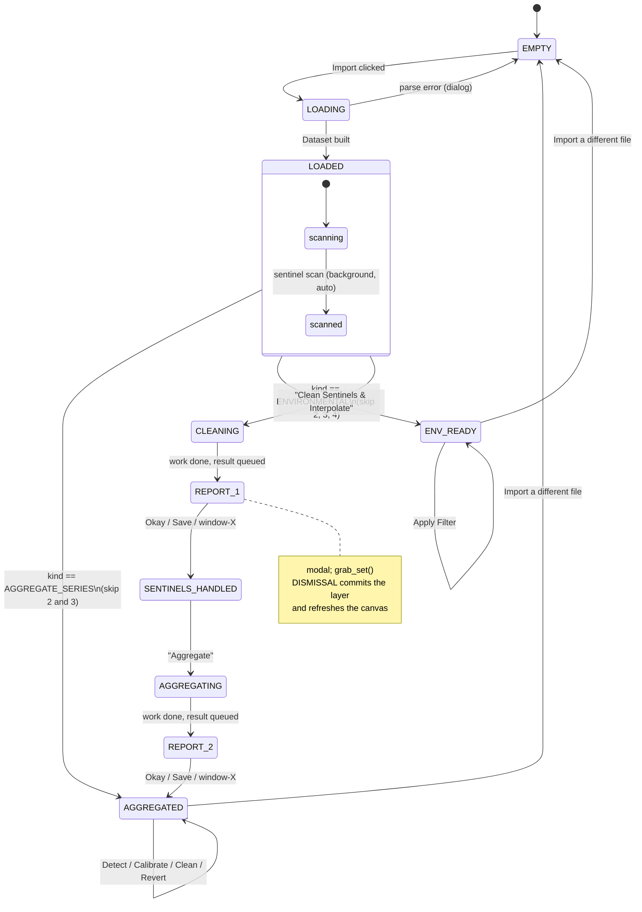

# Load Data Preprocessing & Visualisation Pipeline — UI/UX Architecture

**Status:** design proposal, not yet implemented
**Author role:** Lead UI/UX Software Architect
**Date:** 2026-09-08
**Supersedes:** the ad-hoc section layout currently in `app.py`

---

## 0. Three measurements that shaped this design

Before proposing anything I benchmarked the real pipeline on real data
(66 households, 5-minute resolution, tiled to an 8-month span of 72,576
rows — the shape you are actually working with). Every number below is
measured on this container, not estimated.

| Operation | Time | Notes |
|---|---|---|
| **Parse the 8-month `.xlsx`** | **55.5 s** | `openpyxl`, single-threaded |
| Full deep copy of the panel | 0.131 s | 38.9 MB, float64 |
| Sentinel mask + replace | 0.017 s | |
| Interpolate all 66 columns | 0.13 s | `limit=24`, both directions |
| Aggregate (sum across households) | 0.007 s | |
| Pickle round-trip of a layer | 0.15 s write / 0.16 s read | 38.9 MB on disk |
| Matplotlib draw, 72k points | 0.09 s | one household or the aggregate |
| Matplotlib draw, 350k points | 0.40 s | 1-minute solar, 8 months |

Three conclusions follow, and they determine most of what is below:

1. **Import is the only slow thing in this application.** It is 400×
   slower than every pipeline stage put together. All perceived
   sluggishness the user will ever report is the `.xlsx` parser. This is
   where the engineering effort belongs — not in the layer system.

2. **Full immutable copies are free.** A layer costs 0.131 s and 38.9 MB.
   Four layers (Raw → Sentinels-replaced → Interpolated → Aggregated) is
   156 MB and half a second in total. There is no case for lazy
   evaluation, copy-on-write trickery, or spilling to disk at this scale.
   The design below therefore keeps whole frames and stays simple.

3. **Do not build display decimation yet.** 0.40 s for the worst case
   (350k solar points) is acceptable. I have specified the *seam* where
   decimation would go, and the trigger condition for adding it, but
   building it now would be optimising a cost that has not appeared.

> A note on honesty in this document: where I am specifying something
> that does not exist yet I say so. Where the existing code already does
> the job I say that too, rather than re-specifying it as new work.

---

## 1. Multi-Format Data Ingestion

### 1.1 The problem with the current loader

`data_loader.load_load_profile()` distinguishes formats by a single
structural test — does cell `(0,0)` parse as a timestamp? If yes, the
file has no header and columns are auto-named `Household_01…NN`; if no,
row 0 is a header and names are kept.

That test is sound and should be kept, but it is *structural only*, and
it silently mis-handles the third input:

| Input | Header? | Current verdict | Correct verdict |
|---|---|---|---|
| `Westridge_2002_dupe.xlsx` (66 households) | no | multi-column panel | ✅ household panel |
| `aggregate_total_load.csv` | yes | 1 named value column | ✅ aggregate series |
| `Stellies_2023.xlsx` (GHI + temp) | yes | **"2 named value columns"** | ❌ environmental |

The solar file is classified identically to a two-household aggregate
export. Nothing in the loader knows that `GHI` must be low-pass
filtered and clamped to 0–1400 W/m², while `total_active_power_kw` must
be Z-score screened and never clamped. The GUI currently papers over
this by making every button available for every file and trusting the
user to pick the right one.

**The fix is a second, semantic classification stage.** Structure tells
you how to *parse*; semantics tell you what the columns *mean*, and
meaning is what the UI must gate on.

### 1.2 Two-stage parse

```
                 ┌──────────────────────────────────────────┐
   file path ──► │ STAGE A — structural parse (exists today)│
                 │  · reader by suffix (.csv/.xlsx/.xls)    │
                 │  · header sniff on cell (0,0)            │
                 │  · timestamps → DatetimeIndex, floor min │
                 │  · sort, de-duplicate                    │
                 └────────────────────┬─────────────────────┘
                                      ▼
                 ┌──────────────────────────────────────────┐
                 │ STAGE B — semantic classification (NEW)  │
                 │  per column: name → range → shape        │
                 │  ⇒ ChannelRole for each column           │
                 │  ⇒ DatasetKind for the file              │
                 │  + sampling interval, regularity, gaps   │
                 └────────────────────┬─────────────────────┘
                                      ▼
                              Dataset (§1.4)
```

### 1.3 The classifier

Three signals, applied in order, cheapest first. Each returns a role and
a confidence; the highest-confidence role wins, and anything below a
confidence floor becomes `UNKNOWN` and prompts the user rather than
guessing.

**Signal 1 — column-name lexicon** (confidence 0.9 on a hit)

```python
ROLE_PATTERNS = {
    ChannelRole.IRRADIANCE:  r"\b(ghi|dni|dhi|irradian|insolat|solar[_ ]?rad)\b",
    ChannelRole.TEMPERATURE: r"\b(temp|t_?amb|ambient|deg[_ ]?c|°c)\b",
    ChannelRole.POWER:       r"\b(kw|k_?w|power|load|demand|active|total)\b",
}
```

**Signal 2 — structural shape** (confidence 0.6)

- no header row + ≥2 value columns → every column is `POWER`, kind is
  `HOUSEHOLD_PANEL`
- header + exactly 1 value column → `POWER`, kind is `AGGREGATE_SERIES`
- header + 2–4 value columns → ambiguous; defer to signals 1 and 3

**Signal 3 — physical fingerprint** (confidence 0.8; also a *validator*
that can veto signals 1 and 2)

This is the signal that works when the column is called `Column3`:

| Test | Irradiance | Temperature | Power |
|---|---|---|---|
| Fraction of samples ≈ 0 | **> 0.3**, and concentrated at night | ~0 | ~0 (households are never all-off) |
| Negative values present | never | often | never |
| Observed range | 0 … ~1400 | −20 … 60 | 0 … unbounded |
| Autocorrelation at lag 1 day | very strong | strong | strong |
| Diurnal minimum | hard floor at exactly 0 | soft, no floor | soft, no floor |

The **nightly-zero test is the discriminator**. Irradiance is the only
one of the three signals in this domain that is *identically zero* for
roughly half of every 24-hour period. It is nearly impossible to
mis-classify irradiance once you test for it, and it is robust to
whatever the column happens to be named.

**Conflict policy.** If signal 1 says `TEMPERATURE` but the observed
range is 0–1180 with a nightly zero floor, signal 3 vetoes and the
result is `IRRADIANCE` *with a warning surfaced in the import banner*:
"Column `temp_2` was named as temperature but behaves like irradiance
(52% night-time zeros, range 0–1180). Treating it as irradiance —
click to override." Never silently overrule the user's own column
names; tell them and give them the override.

### 1.4 The standardised internal structure

Every module downstream consumes exactly this. It is the contract.

```python
class ChannelRole(Enum):
    POWER = "power"            # kW, ≥0, no clamping, Z-score screened
    IRRADIANCE = "irradiance"  # W/m², clamp [0,1400], low-pass 30 min
    TEMPERATURE = "temperature"# °C, clamp [-20,60], low-pass 15 min
    UNKNOWN = "unknown"

class DatasetKind(Enum):
    HOUSEHOLD_PANEL = "household_panel"    # N power columns, needs agg
    AGGREGATE_SERIES = "aggregate_series"  # 1 power column, agg done
    ENVIRONMENTAL = "environmental"        # GHI and/or temperature

@dataclass(frozen=True)
class Channel:
    name: str
    role: ChannelRole
    unit: str
    valid_range: tuple[float, float] | None   # None ⇒ never clamp
    default_cutoff_min: float | None          # None ⇒ no low-pass offered
    confidence: float
    note: str = ""            # e.g. the veto message above

@dataclass(frozen=True)
class Dataset:
    frame: pd.DataFrame           # DatetimeIndex, one column per channel
    channels: dict[str, Channel]
    kind: DatasetKind
    interval: pd.Timedelta        # median sampling step
    is_regular: bool              # True if every step == interval
    source: Path
    layer_name: str               # "Raw", "Interpolated", "Aggregated", …
```

**The single most important consequence:** the sidebar gates on
`kind` and `role`, not on file extension. A `HOUSEHOLD_PANEL` gets the
sentinel/interpolate/aggregate chain; an `ENVIRONMENTAL` dataset gets
the low-pass card and no aggregation; an `AGGREGATE_SERIES` gets outlier
detection, calibration and cleaning. **And when the Aggregate step runs,
its output is a `Dataset` of kind `AGGREGATE_SERIES`** — structurally
identical to a `.csv` the user could have imported directly. That is
what makes the pipeline converge: after aggregation there is exactly one
code path, whether the user aggregated here or loaded pre-aggregated
data. This satisfies the requirement that the final render be
"effectively the `.csv` format" *by construction* rather than by
convention.

### 1.5 Regularisation and the edge cases that must be named

`signal_filters._uniform_grid()` already regularises an index onto a
uniform grid — but it does so privately, inside the filter. Hoist it to
ingest so every module receives a regular index and nothing has to
re-derive it.

Cases the loader must handle explicitly (each one is a real failure I
would expect from utility exports):

| Case | Policy |
|---|---|
| Duplicate timestamps | keep first, count them, surface in the import banner |
| Unsorted rows | sort (already done) |
| Sub-second jitter | floor to minute (already done) |
| Irregular / missing rows | reindex onto the uniform grid; the new rows are NaN and become sentinel-equivalent holes |
| DST spring-forward | data is tz-naive local time, so this is a genuine 1-hour hole — **flag it, never interpolate it silently**; a 1-hour fabricated block would poison a forecasting training set |
| DST fall-back | duplicate hour → duplicate-timestamp policy above |
| All-NaN column | drop with a warning; a household that never reported is not a household |
| Single row / empty file | reject at the loader with a clear message |
| Mixed dtype column (text in a numeric field) | coerce with `errors="coerce"`, count the coercions, report them alongside sentinels |

### 1.6 Import performance — where the real work is

55.5 s is a long time to stare at a frozen window. Three measures, in
order of value:

1. **Keep the background thread** (already in `app.py` as
   `_load_in_background`) and add a determinate progress bar. `openpyxl`
   can be read in `read_only=True` row-streaming mode, which lets you
   emit progress per 1000 rows.
2. **Session cache, keyed by `(path, mtime, size)`.** On import, look for
   `~/.load_profile_gui/cache/<sha1>.pkl`; on a hit, `read_pickle` in
   0.16 s instead of parsing in 55.5 s — a **350× speedup on reopen**.
   Pickle needs no new dependency and round-trips dtypes exactly. Cache
   entries are disposable; a corrupt or version-mismatched entry falls
   back to a full parse.
3. **`read_only=True` + `values_only=True`** on the openpyxl worksheet
   typically halves cold-parse time on its own.

---

## 2. UI/UX Widget Hierarchy

### 2.1 Why the current layout has to change

`app.py` stacks `ttk.LabelFrame` sections vertically: *1. Import Data*,
*2. Choose Series & Time Range*, *3. Outliers*, *4. Low-Pass Filter*.
Adding *Sentinels & Interpolate*, *Aggregate* and *Data Properties* to
that stack takes it to seven bands. At a 760 px window the canvas is
already the smallest element on screen; seven bands would leave it
roughly 200 px tall. The plot is the product. It cannot be the thing
that gets squeezed.

Vertical stacking also communicates the wrong thing. It reads as
"here are seven independent panels" when the truth is "here is one
ordered pipeline, and you are at step 3 of 5."

### 2.2 Proposed layout

```
┌──────────────────────────────────────────────────────────────────────────────────┐
│ TOOLBAR  [Import…]  Westridge_2002_dupe.xlsx  ◆HOUSEHOLD PANEL·66ch·5min   [ⓘ Data│
│                                                             Properties] [Export▾]│
├───────────────────────┬──────────────────────────────────────────┬───────────────┤
│ PIPELINE (sidebar)    │ VIEW BAR                                 │ INSPECTOR     │
│  ~260px, scrollable   │  Series[Household_01▾]  Start[…] End[…]  │  (slide-out,  │
│                       │  [Day][Week][Month][Full]   ◀  ▶         │   ~300px)     │
│ ✓ 1 IMPORT            │  View:[Time Series▾]        [Plot]       │               │
│   66 households       ├──────────────────────────────────────────┤ Window        │
│   2002-02-01→08-31    │                                          │ 2002-02-01 →  │
│                       │            MAIN CANVAS                   │ 2002-02-07    │
│ ● 2 SENTINELS         │        (FigureCanvasTkAgg)               │ 2 016 samples │
│   864 found (0.16%)   │                                          │               │
│   [Clean Sentinels    │      ── raw ── cleaned ○ outliers         │ Distribution  │
│    & Interpolate]     │                                          │  lognormal    │
│   Max gap [24] ⓘ      │                                          │  (AIC best)   │
│                       │                                          │  skew  +1.42  │
│ ○ 3 AGGREGATE         │                                          │  kurt  +3.11  │
│   [Aggregate]         │                                          │               │
│   ⓘ needs step 2      ├──────────────────────────────────────────┤ mean   181.4  │
│                       │ [matplotlib nav toolbar]                 │ median 168.2  │
│ — 4 OUTLIERS          ├──────────────────────────────────────────┤ min     42.1  │
│   not applicable      │ STATUS  Layer: Raw · 66 ch · 0 modified  │ max    612.8  │
│   until aggregated    │                                          │ missing 0.16% │
│                       │                                          │               │
│ — 5 LOW-PASS FILTER   │                                          │  [Copy] [CSV] │
│   no solar channels   │                                          │               │
└───────────────────────┴──────────────────────────────────────────┴───────────────┘
```

### 2.3 Widget tree

```
LoadProfileApp (tk.Tk)
├── toolbar : ttk.Frame                                   [always enabled]
│   ├── btn_import        : tk.Button (ACCENT)
│   ├── lbl_source        : ttk.Label      — filename
│   ├── badge_kind        : ttk.Label      — kind · channels · interval
│   ├── btn_properties    : ttk.Button     — toggles the inspector
│   └── menu_export       : ttk.Menubutton — current layer / all reports
│
├── body : ttk.PanedWindow (horizontal, sashes user-draggable)
│   │
│   ├── sidebar : ttk.Frame (width 260, vertical scroll)
│   │   └── StepCard × 5      ← one reusable widget class, §2.4
│   │       ├── header  : glyph + number + title
│   │       ├── summary : ttk.Label (muted) — one line of state
│   │       ├── params  : ttk.Frame — the step's own inputs
│   │       └── action  : tk.Button — the step's primary verb
│   │
│   ├── centre : ttk.Frame
│   │   ├── viewbar : ttk.Frame
│   │   │   ├── cmb_channel  : ttk.Combobox
│   │   │   ├── date_start / date_end : DateEntry
│   │   │   ├── range_toggle : ttk.Frame — Day│Week│Month│Full (radio group)
│   │   │   ├── btn_prev / btn_next : ttk.Button — ◀ ▶ page by the active span
│   │   │   ├── cmb_view     : ttk.Combobox — Time Series │ Distribution
│   │   │   └── btn_plot     : tk.Button (ACCENT)
│   │   ├── canvas  : FigureCanvasTkAgg
│   │   ├── navbar  : NavigationToolbar2Tk
│   │   └── status  : ttk.Label — layer breadcrumb + last action
│   │
│   └── inspector : ttk.Frame (width 300, collapsible)     [§5]
│
└── modals : Toplevel, created on demand                   [§3.5]
    ├── ReportModal      — Sentinel & Interpolation, Aggregation, Cleaning, Filter
    └── CalibrationModal — F1 heatmap (exists today)
```

### 2.4 `StepCard` — the one widget that carries the design

Every pipeline step is the same widget with different content. That
uniformity is what makes the sequence legible.

| Glyph | State | Rendering |
|---|---|---|
| `✓` | **Done** | green glyph, summary shows the outcome ("864 sentinels replaced, 812 interpolated"), action button becomes secondary ("Re-run") |
| `●` | **Available** | accent glyph, action button is the only accent-coloured button in the sidebar — the eye goes straight to the next thing to do |
| `○` | **Blocked** | grey glyph, action disabled, summary states the *reason* ("needs step 2") |
| `—` | **Not applicable** | grey glyph, action disabled, summary states why ("no solar channels in this dataset") |
| `⟳` | **Running** | animated, action becomes `Cancel` |

**Design rule: never hide a step.** A card that disappears reads as a
bug and destroys the user's mental model of the pipeline; a card that is
present, greyed, and explains itself *teaches* the pipeline. This is the
main reason for a sidebar rather than a wizard — the whole sequence stays
visible at once, and the user can always see where they are and what is
coming.

**Exactly one accent-coloured button exists at any moment.** It is the
next legal action. This is the entire navigation affordance; on macOS
aqua this must be a plain `tk.Button`, since `ttk.Button` ignores `bg`
(already discovered and worked around in the current code).

### 2.5 Card contents by dataset kind

| Card | HOUSEHOLD_PANEL | AGGREGATE_SERIES | ENVIRONMENTAL |
|---|---|---|---|
| 1 Import | ✓ | ✓ | ✓ |
| 2 Sentinels & Interpolate | ● active | — already clean | — n/a |
| 3 Aggregate | ○ → ● after 2 | — already aggregated | — n/a |
| 4 Outliers (detect/calibrate/clean) | ○ until aggregated | ● active | — use low-pass instead |
| 5 Low-Pass Filter | — no solar channels | — no solar channels | ● active |

The table *is* the enablement predicate. It is implemented once, in
`_refresh_enablement()` (§3.4), and nowhere else.

---

## 3. Event-Driven State Machine

### 3.1 Avoiding state explosion: three orthogonal axes

Modelling this as one flat enum gives ~40 states once you cross pipeline
progress with analysis overlays. Instead, three independent axes:

```python
@dataclass
class AppState:
    stage:   Stage      # linear, gated, monotonic (except Revert)
    overlay: Overlay    # free, reversible, does not gate anything
    busy:    Busy|None  # transient: a worker is running
    modal:   Modal|None # transient: a report window has grab_set()
```

- **`Stage`** — `EMPTY → LOADED → SENTINELS_HANDLED → AGGREGATED`.
  Monotonic. This is the axis the sidebar gates on.
- **`Overlay`** — `NONE | OUTLIERS_MARKED | OUTLIERS_CLEANED | FILTERED`.
  Free and reversible. Overlays are *views and edits on the active
  layer*; they never advance the stage and never gate another step.
- **`Busy`** — a worker thread is running (`LOADING`, `CLEANING`,
  `AGGREGATING`, `CALIBRATING`, `FILTERING`). Blocks every action except
  Cancel.
- **`Modal`** — a report `Toplevel` holds `grab_set()`. Blocks everything.

Separating stage from overlay is what keeps this tractable: detecting
outliers on the aggregate must not change whether the Aggregate button
is enabled, and today's code has no structural reason preventing that
kind of coupling from creeping in.

### 3.2 The main sequence



### 3.3 Transition table

| # | From | Event | Guard | Effect | To |
|---|---|---|---|---|---|
| T1 | EMPTY | `Import` | file chosen | worker parses; `busy=LOADING` | LOADING |
| T2 | LOADING | `load_ok` | — | push layer *Raw*; classify; auto-scan sentinels in background | LOADED |
| T3 | LOADING | `load_err` | — | error dialog; discard | EMPTY |
| T4 | LOADED | *(auto)* | `kind == AGGREGATE_SERIES` | mark steps 2–3 not-applicable | AGGREGATED |
| T5 | LOADED | *(auto)* | `kind == ENVIRONMENTAL` | mark steps 2–4 not-applicable | ENV_READY |
| T6 | LOADED | `Clean+Interp` | `kind == HOUSEHOLD_PANEL` ∧ `max_gap` valid | worker runs `SentinelStep` then `InterpolateStep`; `busy=CLEANING` | CLEANING |
| T7 | CLEANING | `work_ok` | — | **hold** the new layer; open modal | REPORT_1 |
| T8 | CLEANING | `Cancel` | — | discard worker result | LOADED |
| T9 | REPORT_1 | `Save` | path chosen | write `.txt` (+ optional `.xlsx`); **stay open** | REPORT_1 |
| T10 | REPORT_1 | `Okay` / window-X | — | **commit** held layer → active; refresh canvas | SENTINELS_HANDLED |
| T11 | SENTINELS_HANDLED | `Aggregate` | — | worker sums; `busy=AGGREGATING` | AGGREGATING |
| T12 | AGGREGATING | `work_ok` | — | hold layer; open modal | REPORT_2 |
| T13 | REPORT_2 | `Okay` / window-X | — | commit; **kind becomes `AGGREGATE_SERIES`**; select the aggregate channel; refresh | AGGREGATED |
| T14 | AGGREGATED | `Detect` | window·σ pair reachable (§3.6) | draw red overlay | AGGREGATED, `overlay=OUTLIERS_MARKED` |
| T15 | AGGREGATED | `Clean Data` | — | worker pops + B-spline fills; modal; commit on dismiss | AGGREGATED, `overlay=OUTLIERS_CLEANED` |
| T16 | AGGREGATED | `Revert` | a cleaned layer exists | move `active` pointer back one | AGGREGATED, `overlay=NONE` |
| T17 | ENV_READY | `Apply Filter` | cutoff > 2·interval | worker filters; modal; commit on dismiss | ENV_READY, `overlay=FILTERED` |
| T18 | *any* | `Import` | confirm if unsaved work | tear down stack | EMPTY |

### 3.4 One enablement function, called after every transition

This is the most important implementation rule in the document.

I counted the current code: `app.py` sets widget state at **48 sites
across 14 methods** — `_on_load_success`, `_on_import`, `_on_revert`,
`_on_clean_data`, `_on_calibrate`, `_on_apply_filter`, `_draw`,
`_draw_distribution`, `_poll_calibration`, `_set_date_range`, and the
three report windows, on top of the initial states set in
`_build_layout`. Every one of those is a place a future gating bug can
be introduced, and a gating bug is exactly what the requirement "disable
Aggregate until Interpolation is confirmed" exists to prevent. Enablement
that lives in 14 methods cannot be reasoned about; enablement that is a
pure function of state can.

```python
def _refresh_enablement(self) -> None:
    """The ONLY place widget state is set. Pure function of self.state."""
    s = self.state
    blocked = s.busy is not None or s.modal is not None
    kind = self.stack.active_layer.kind if self.stack else None

    def gate(widget, ok: bool, reason: str = "") -> None:
        widget.configure(state="normal" if (ok and not blocked) else "disabled")
        ...  # card summary shows `reason` when not ok

    gate(self.card_sentinels.action,
         kind is DatasetKind.HOUSEHOLD_PANEL and s.stage is Stage.LOADED,
         "not applicable — this file is already aggregated")

    gate(self.card_aggregate.action,
         kind is DatasetKind.HOUSEHOLD_PANEL and s.stage is Stage.SENTINELS_HANDLED,
         "run step 2 first")

    gate(self.card_outliers.action,
         s.stage is Stage.AGGREGATED,
         "aggregate the households first")

    gate(self.card_filter.action,
         any(c.role in (ChannelRole.IRRADIANCE, ChannelRole.TEMPERATURE)
             for c in self.channels.values()),
         "no irradiance or temperature channels in this dataset")

    gate(self.btn_properties, self.stack is not None)   # persistent — §5
    gate(self.card_outliers.revert, self.stack.can_revert())
```

Call it from exactly one place — the state setter:

```python
def _transition(self, **changes) -> None:
    self.state = replace(self.state, **changes)
    self._refresh_enablement()
    self._refresh_status_bar()
```

No handler ever calls `widget.configure(state=…)` directly. If a button
is wrong, there is exactly one function to read.

### 3.5 The modal contract

The requirement is that executing clean/interpolate *halts the main UI*
and requires interaction. Four details make that work correctly:

```python
class ReportModal(tk.Toplevel):
    def __init__(self, parent, title, body, on_save, on_dismiss):
        ...
        self.transient(parent)            # 1. rides with the main window
        self.grab_set()                   # 2. truly modal — halts the UI
        self.protocol("WM_DELETE_WINDOW", self._dismiss)   # 3. X == Okay
        parent.wait_window(self)          # 4. caller blocks until closed
```

1. **`transient()`** keeps it above the main window and off the taskbar.
2. **`grab_set()`** is what actually halts the UI. Without it the user
   can click Aggregate while the report is open — the exact gating hole
   the requirement is written to close.
3. **`WM_DELETE_WINDOW` must map to the same handler as Okay.** If
   closing via the title-bar X skipped the commit, the app would land in
   a state where the work is done but the UI says it is not, and the
   only escape is re-running it. Treat X as acknowledgement.
4. **`wait_window()`** lets the calling handler read as a straight line:

```python
def _on_clean_and_interpolate(self):
    result = yield_from_worker(...)        # already off the main thread
    held = self.stack.stage_layer(result.dataset, "Interpolated")
    ReportModal(self, "Sentinel & Interpolation Report", result.report,
                on_save=lambda p: result.save(p), on_dismiss=None)
    self.stack.commit(held)                # runs after the modal closes
    self._transition(stage=Stage.SENTINELS_HANDLED)
    self._redraw()
```

**Compute first, then show.** The modal opens only once the worker has
finished and the result is on the queue. A modal that appears while work
is still running would either lie about the numbers or need to
repaint itself mid-display.

**Save does not dismiss.** A user who saves and then wants to re-read the
report should not have to re-run the step. Save writes and leaves the
window open with a confirmation line.

### 3.6 Guards worth stating explicitly

| Guard | Rule | Why |
|---|---|---|
| Z-score reachability | reject if `n_sigmas > (window−1)/√window` | Shiffler's ceiling — already implemented and verified exactly against this data; a 12/5.0 pair can *never* flag anything, and silently flagging nothing is the worst possible failure |
| Filter cutoff | reject if `cutoff < 2 × interval` | Nyquist |
| Max gap | reject if `max_gap ≤ 0` or > 10% of the span | fabricating a long block into a forecasting training set is worse than leaving a hole |
| Import over unsaved work | confirm before tearing down the stack | |
| Empty visible window | disable Plot / Data Properties | statistics on zero samples |

---

## 4. Memory Management Strategy

### 4.1 The model: an append-only layer stack

```python
@dataclass(frozen=True)
class Layer:
    id: int
    dataset: Dataset            # immutable; never mutated in place
    parent_id: int | None
    step_name: str              # "Raw" | "Sentinels" | "Interpolated" | …
    report: str                 # the exact text shown in the modal
    changes: pd.DataFrame       # long-format ledger, §4.3
    created_at: datetime

class LayerStack:
    layers: list[Layer]         # append-only; nothing is ever deleted
    active: int                 # index — the ONLY mutable field
```

Two rules carry the whole requirement:

1. **No frame is ever mutated in place.** Every step returns a new
   `Dataset`; the old one stays in the list. "Non-destructive" is a
   structural property, not a discipline someone has to remember.
2. **Revert moves the `active` pointer.** It does not restore from a
   backup. `_pre_clean_df` in the current code is a single-slot,
   one-level-deep version of this; generalising it to a stack gives
   unlimited undo, an audit trail, and A/B comparison for free.

```
        ┌───────┐   ┌────────────┐   ┌──────────────┐   ┌────────────┐
  file ►│ L0    │──►│ L1         │──►│ L2           │──►│ L3         │
        │ Raw   │   │ Sentinels  │   │ Interpolated │   │ Aggregated │
        │ 66ch  │   │ 66ch       │   │ 66ch         │   │ 1ch        │
        │38.9MB │   │ 38.9MB     │   │ 38.9MB       │   │ 0.6MB      │
        └───────┘   └────────────┘   └──────────────┘   └────────────┘
                                                              ▲
                                                           active
                                                        (canvas draws
                                                         from here)
```

### 4.2 The budget, measured

| Layer | Shape | float64 | float32 |
|---|---|---|---|
| L0 Raw | 72,576 × 66 | 38.9 MB | 19.5 MB |
| L1 Sentinels → NaN | same | 38.9 MB | 19.5 MB |
| L2 Interpolated | same | 38.9 MB | 19.5 MB |
| L3 Aggregated | 72,576 × 1 | 0.6 MB | 0.3 MB |
| L4 Outliers cleaned | 72,576 × 1 | 0.6 MB | 0.3 MB |
| **Total resident** | | **~118 MB** | **~59 MB** |

Against a typical 8–16 GB desktop this is not worth optimising, and the
copy that produces each layer costs 0.131 s. **Keep whole frames.**

Two cheap safety valves, in priority order:

- **Cast to `float32` at ingest.** Power in kW to 7 significant figures
  is far beyond metering accuracy (utility meters are ~0.5% class), and
  irradiance sensors are ±2% at best. Halves every number above. Do
  keep the *index* at nanosecond precision.
- **A layer cap.** If the stack exceeds ~1 GB (which needs ~25 layers, or
  a dataset 8× larger than yours), evict the oldest *interior* layer —
  never L0 and never `active` — to `~/.load_profile_gui/session/<id>.pkl`
  and keep a lazy handle. At 0.16 s to reload, the user would not notice.
  **Do not build this until a dataset actually needs it**; the seam is
  `LayerStack._evict_if_needed()`, called after every `commit()`.

### 4.3 The change ledger — the part that is *not* a copy

Sentinel replacement touches **864 of 532,224 cells (0.162%)**. Outlier
cleaning touches a similar order. Keeping only whole frames would mean a
0.16% change is recorded as a 38.9 MB snapshot with no record of *which*
cells changed or *why* — and "why is this value 4.2 and not −999?" is a
question you will be asked six months from now by whoever reviews the
forecasting model.

So each layer carries, alongside its frame, a compact long-format ledger:

| timestamp | channel | before | after | reason |
|---|---|---|---|---|
| 2002-02-03 04:15 | Household_07 | −999.0 | NaN | sentinel code −999 |
| 2002-02-03 04:15 | Household_07 | NaN | 1.842 | linear interp, gap 3 |
| 2002-02-11 18:40 | total_kw | 918.4 | 402.7 | Z-score 4.8σ → B-spline |

864 rows × 5 columns ≈ **35 KB**, against a 38.9 MB frame. The ledger is:

- what the report renders from (it already does, in
  `CleaningResult.corrections`)
- what `Save` exports as a machine-readable audit CSV
- what lets the canvas draw a "modified" marker under any changed point
- the provenance record that makes the whole pipeline defensible

Generalise `CleaningResult.corrections` into this shape and have every
step emit one.

### 4.4 Caches

Two, both keyed on immutable layer ids — which is exactly why layers
being immutable matters. An immutable key can never go stale.

| Cache | Key | Why | Size |
|---|---|---|---|
| Statistics | `(layer_id, channel, t0, t1)` | the inspector recomputes on every window change; distribution fitting (§5) is the most expensive thing on the UI thread | LRU 64 entries, ~100 KB |
| Import | `sha1(path, mtime, size)` → pickle | 55.5 s → 0.16 s on reopen | bounded to ~500 MB on disk, LRU-evicted |
| Draw envelope | `(layer_id, channel, px_width)` | **not built** — see §0, conclusion 3 | — |

### 4.5 Thread ownership — the rule that keeps all of this true

The earlier `RuntimeError: main thread is not in main loop` in the
B-spline work was not a one-off; it was a missing ownership rule. State
it once and it cannot recur:

> **Worker threads may only read layers, and must return new frames
> through a `queue.Queue`. Only the main thread appends to the stack,
> moves `active`, or touches a Tk widget.**

```python
# worker
def _work(self, fn, dataset, tag):
    try:
        self._queue.put((tag, "ok", fn(dataset)))     # reads only
    except Exception as exc:
        self._queue.put((tag, "err", exc))

# main thread — the ONLY writer
def _poll(self):
    try:
        tag, status, payload = self._queue.get_nowait()
    except queue.Empty:
        self.after(100, self._poll); return
    ...                                 # append, commit, open modal
```

Because layers are immutable, a worker reading L2 while the main thread
appends L3 is safe by construction — there is no shared mutable state to
race on. That is the second reason for immutability, after undo.

The calibration code already uses this pattern correctly
(`_calibration_queue` + `_poll_calibration`). Every new step should
route through the same generic `_work` / `_poll` pair rather than growing
its own queue.

---

## 5. Universal Statistical Inspector

### 5.1 Placement and scope

- **Persistent.** Enabled whenever `self.stack is not None`, in every
  stage, for every dataset kind. It is on the toolbar, not in the
  pipeline sidebar, because it is not a pipeline step.
- **A panel, not a modal.** The requirement allows either. A panel is
  better here: it lets the user page ◀ ▶ through weeks and watch the
  statistics update live, which is how you actually find the anomalous
  week. A modal forces open-read-close on every window change.
- **Scoped to the visible window and channel.** It reads the same
  `ViewSpec` the canvas draws from, so what it reports is always what is
  on screen. It must recompute on channel change, date change, preset
  change, page, *and* layer change.

### 5.2 Metrics

**Required:** distribution type, mean, median, max, min.
**Added, because they are free and they answer the next question:**

| Group | Metrics |
|---|---|
| Coverage | n samples, n missing, % missing, longest gap, span, interval |
| Centre | mean, median, mode (KDE peak) |
| Spread | std, IQR, MAD, min, max, range, CV |
| Shape | skewness, excess kurtosis, p1/p5/p25/p75/p95/p99 |
| Distribution | best-fit family + goodness + runner-up (§5.3) |
| Energy | total kWh over the window (POWER channels only) |

### 5.3 "Distribution type" — how to answer it honestly

This is the one metric that is easy to get wrong, so it needs a
specified method rather than a library call.

**Method: fit-and-rank by AIC.**

```python
CANDIDATES = ["norm", "lognorm", "gamma", "weibull_min", "expon", "uniform"]

for family in CANDIDATES:
    params = scipy.stats.__dict__[family].fit(x)
    ll = dist.logpdf(x, *params).sum()
    aic = 2 * len(params) - 2 * ll
# rank by AIC; report winner, ΔAIC to runner-up, and a KS distance
```

Report as: **"lognormal (best of 6 by AIC; ΔAIC 412 over gamma; KS D = 0.031)"**
— the winner, the margin, and an absolute goodness measure. A winner
with ΔAIC ≈ 2 over the runner-up is not a real answer, and the UI should
say "lognormal or gamma — indistinguishable on this window" instead of
picking one.

**Alongside it, a plain-language verdict from the moments**, because
that is what most users actually want:

| Condition | Verdict |
|---|---|
| \|skew\| < 0.5 and \|excess kurt\| < 1 | "approximately normal" |
| skew > 1 | "right-skewed — long tail of high demand" |
| excess kurt > 3 | "heavy-tailed — spikes more common than normal" |
| KDE has ≥2 prominent peaks | "bimodal — likely a morning and evening peak" |

Bimodality matters specifically for load data: a household daily profile
usually *is* bimodal, and reporting "not normal" without saying "because
it has two peaks" is a wasted diagnosis.

### 5.4 Two traps this inspector must not fall into

**Trap 1 — zero-inflation on irradiance.** Over a full day, GHI is
*exactly* zero for roughly half the samples. No continuous distribution
describes that, and every fit above will return nonsense with high
confidence. The inspector must test for a point mass at zero first:

> if `(x == 0).mean() > 0.2` → report
> **"zero-inflated: 52.1% exact zeros (night), remainder fitted separately"**
> and run the fit on the non-zero subset only, with a "daytime only"
> toggle in the panel.

This is not a corner case — it is the *normal* case for the Stellenbosch
data, and getting it wrong would produce a confidently wrong answer on
the single most-inspected channel.

**Trap 2 — normality tests at large n.** Shapiro–Wilk is capped at
n = 5000 and, at n = 72,576, every normality test rejects; real data is
never exactly normal and the test simply detects that. Reporting
"p < 0.001, not normal" is true, useless, and misleading about
magnitude.

> **Report effect sizes, never p-values.** Skewness, excess kurtosis and
> the KS distance D say *how far* from normal; that is the decision-useful
> quantity. If a p-value is shown at all, show it next to n with a note
> that significance is guaranteed at this sample size.

### 5.5 Cost

Six MLE fits on 72,576 points is roughly 0.2–0.5 s — enough to feel like
a stutter if it runs on every ◀ page. Two mitigations: cache on
`(layer_id, channel, t0, t1)` (§4.4), and compute the cheap moments
synchronously while deferring the distribution fit to the worker,
rendering "fitting…" in that one field. The panel stays responsive and
the required metrics (mean/median/min/max) appear instantly.

---

## 6. Migration path from today's `app.py`

Nothing here requires a rewrite. `app.py` is ~1,290 lines and the
analytical modules are sound; the change is structural, and it can be
staged so the app works after every step.

| # | Change | Touches | Risk |
|---|---|---|---|
| 1 | Add `DatasetKind` / `ChannelRole` / `Channel` classification to `data_loader.py`; leave `LoadProfileData` in place as a thin wrapper | `data_loader.py` | low — additive |
| 2 | Extract `LayerStack`; re-point `_pre_clean_df` at it | `app.py` | low — replaces one field |
| 3 | Introduce `_refresh_enablement()`; delete every scattered `configure(state=…)` | `app.py` | **medium — the highest-value change here** |
| 4 | Build `ReportModal` with the §3.5 contract; migrate the three existing report windows onto it | `app.py` | low |
| 5 | Build `StepCard`; re-lay the sidebar; move the existing sections into cards | `app.py` | medium — cosmetic but wide |
| 6 | Wire `clean_sentinels` + `interpolate_and_aggregate` as `PipelineStep`s (they are currently CLI-only) | both modules + `app.py` | medium — **the only genuinely new functionality** |
| 7 | Build the inspector panel | new `statistics.py` + `app.py` | low — pure addition |
| 8 | Import cache + progress bar | `data_loader.py` | low, high payoff |

**Step 6 is the real work.** `clean_sentinels.py` and
`interpolate_and_aggregate.py` are complete and tested, but they are
file-in/file-out scripts (`clean_file`, `process_file`) — they read a
path and write a path. The GUI needs frame-in/frame-out. The functions
underneath already have the right shape:

- `replace_sentinels(df, sentinels) -> (cleaned_df, hits_df)` ✅ pure
- `interpolate_households(df, method, max_gap) -> (df, still_missing)` ✅ pure
- `aggregate_total(df) -> Series` ✅ pure
- `build_report(...)` — takes frames, returns a string ✅ pure

So the decoupling the brief asks for is *already latent in the code*.
Each becomes a `PipelineStep` wrapping the existing pure function; the
composite button runs `[SentinelStep(), InterpolateStep()]` and
concatenates the two reports into one modal with two sections. Splitting
them into two separate buttons later is a change to one list — neither
implementation is touched.

```python
class PipelineStep(Protocol):
    name: str
    def run(self, ds: Dataset, **params) -> StepResult: ...
    # StepResult = (dataset, report_text, changes_ledger)

CHAIN = [SentinelStep(), InterpolateStep()]     # one button
# CHAIN = [SentinelStep()], [InterpolateStep()] # two buttons, same code
```

---

## 7. Decisions I would flag before implementation

1. **The `.xlsx` parse is the user-visible bottleneck** (55.5 s), and it
   is unrelated to any feature in this brief. I would do step 8 of the
   migration table first — it is the smallest change with the largest
   effect on how the app feels.

2. **Sentinel codes are currently hard-coded to `-999`.** Other exports
   use `-9999`, `9999`, `0` (dangerous — a real reading), or blank. The
   sentinel card should expose the code list as an editable field with
   `-999` as the default, and the auto-scan should report *candidate*
   codes it noticed (any value repeated implausibly often at an extreme
   of the range) rather than only the ones it was told to look for.

3. **Solar and load are on different grids** (1 min vs 5 min). Nothing in
   this design resamples them onto a common index, because you have not
   asked for it yet — but the moment PV output is computed from filtered
   GHI and joined to load, that becomes a required step and it deserves
   its own card. I would add it as card 6, "Align & Merge," rather than
   hiding a resample inside the PV calculation.

4. **`Overlay` state is not persisted across a layer commit.** If a user
   detects outliers, then reverts, the red circles should clear — which
   the design does — but if they detect, then aggregate, the circles
   refer to a channel that no longer exists. Clearing overlays on every
   stage transition is the safe rule and what I have specified.
